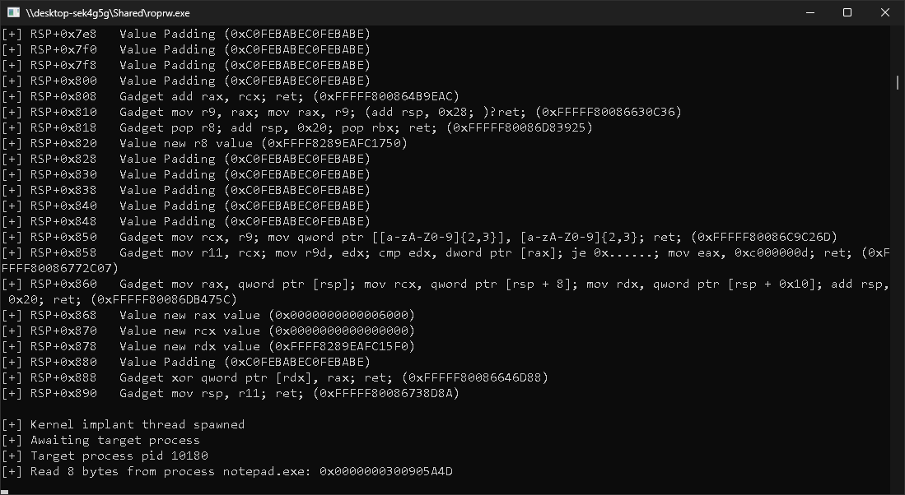

## roprw
An x86_64 Windows kernel implant exposing a read/write primitive for usermode, executed using [ROP (return oriented programming)](https://en.wikipedia.org/wiki/Return-oriented_programming).\
roprw is designed to provide a proof of concept for evading detection from video game anti-cheats using ROP.



## Compiling
```bash
git clone https://github.com/krispybyte/roprw.git
cd roprw
mkdir build/
cmake ..
cmake --build . --config Release    # Release build
cmake --build . --config Debug      # Debug build
```

## Usage
1. Ensure the vulnerable driver `athpexnt.sys` is loaded (found in `drivers/`), this is required in order to bootstrap the implant. You are free to modify the project's code to support any other vulnerable driver.
2. Make sure your target process is running. The project's demo currently performs a memory read from `notepad.exe` as a demo target.
3. Execute roprw, you may be required to run the project as an admin user on newer Windows builds.

## Windows version compatability
For *most* of the gadgets used, I have deliberately chosen gadgets which exist universally between all recent versions of `ntoskrnl.exe` ranging from version Windows 10 22H2 up until Windows 11 25H2 and some insider builds. The gadgets which are not present in some of these versions mentioned, have replacements using if-else statements comparing the build (e.g. [this code example](https://github.com/krispybyte/roprw/blob/d3d5fc12fb50752f0858c4180517b341a33fa7f3/src/rop_thread/stack_manager.cpp#L79-L83)).

Currently, the offsets the project uses for the gadgets are hardcoded and so they must be manually replaced, this is expected to be resolved in the future. This means that currently the project only supports the latest Windows builds, unless you checkout to an older commit, or manually modify the offsets, I recommend finding gadget offsets using [ropper](https://github.com/sashs/Ropper).

If you are interested in seeing examples of how I've updated gadget offsets in the past, see the PR's for issues [51](https://github.com/krispybyte/roprw/pull/51/files) and [35](https://github.com/krispybyte/roprw/pull/35/files).

## How this works (high level explanation)
This project uses a vulnerable driver (`athpexnt.sys`) to patch kernel code and be able to call arbitrary kernel functions from usermode (pretty much equivalent to the [VDM](https://github.com/backengineering/VDM) project), this is needed to call into several functions which bootstrap our kernel ROP thread, such as `ExAllocatePool2`, `PsCreateSystemThread` etc...

Once a system thread is created, it executes our ROP chain, which performs the following:
1. Call `ZwOpenEvent` to event objects created by usermode, this is used for event synchronization
2. Await malicious usermode program to send the PID of the target process, all communications are done via a shared buffer being copied
3. Pivot to a new stack (main stack) which is the equivalent to the body of a `while (true)` loop, meaning it will continuously execute
4. Every iteration, this stack awaits a new request from usermode using the event synchronization
5. Once a request is retrieved, it copies argument data needed such as source address, destination address etc, and calls `MmCopyVirtualMemory` using them.This performs a memory read or a write according to the malicious usermode program's choice

I will probably be updating this project with more technical documentation, regardless I recommend you read the source code and go through the comments to understand it better.

## HVCI compatability
roprw currently loads a vulnerable driver and patches kernel code in order to bootstrap the implant. This is a violation of HVCI's [W^X](https://en.wikipedia.org/wiki/W%5EX) security policy, so the project is not HVCI compatible, but this may be fixable.

## Project GitHub issues
The project is not yet complete, and there are still things left to be done, the major changes planned have descriptions in the GitHub page's issues tab.

*Pull requests are welcome!*
